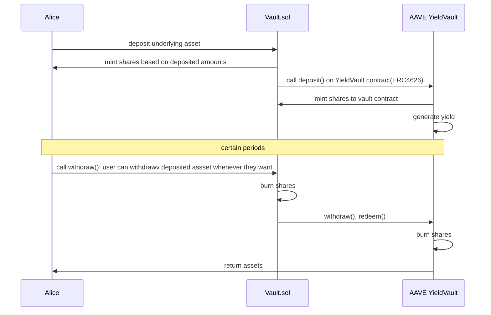

## Sequence Diagram

### Interact with Vault (Deposit → Withdraw assets)



### Determine winning team → distribute prize

```
sequenceDiagram

participant users as Users
participant admin as Admin
participant db as DB
participant vault as Vault.sol


admin ->> db: fetch()
db->> admin: returns point, deposited amount, team status etc...
admin ->> vault: execute draw()
vault->>vault: validate
alt if draw() execute transfer
vault ->> users: transfer prizes based on merkle tree
else if inidividual call claimPrize()
users ->> vault : call claimPrize()
vault ->> users: transfer prize
end
```
