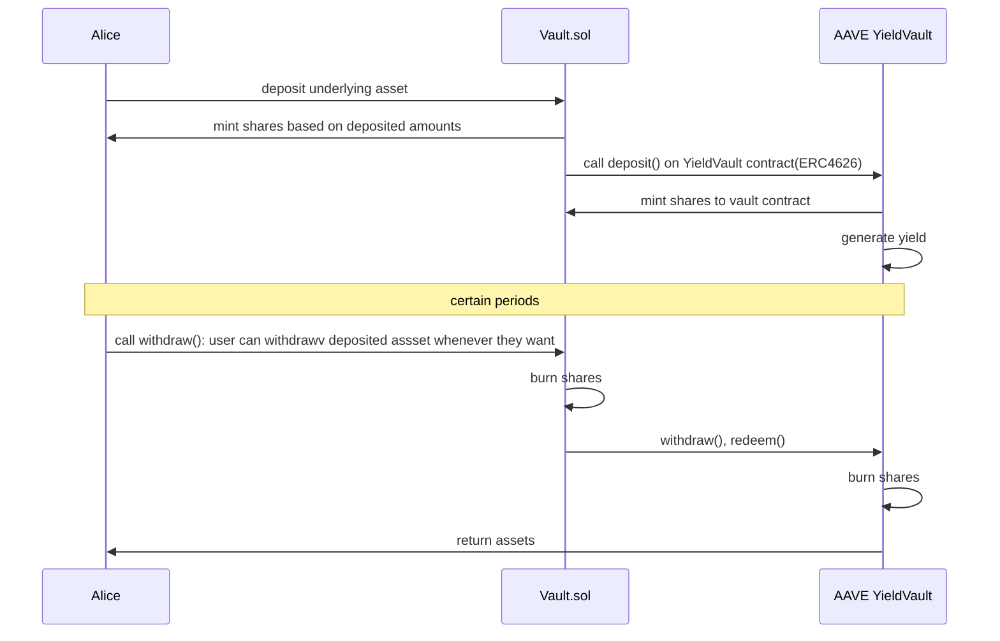

## Sequence Diagram

### Interact with Vault (Deposit → Withdraw assets)

```mermaid
sequenceDiagram
    participant alice as Alice
    participant vault as Vault.sol
    participant aave as AAVE YieldVault

    alice ->> vault: deposit underlying asset
    vault ->> alice: mint shares based on deposited amounts
    vault ->> aave: call deposit() on YieldVault contract(ERC4626)
		aave ->> vault: mint shares to vault contract
    aave ->> aave: generate yield
		Note over alice, aave: certain periods

		alice ->> vault: call withdraw(): user can withdrawv deposited assset whenever they want
		vault ->> vault: burn shares
		vault ->> aave :withdraw(), redeem()
		aave ->> aave: burn shares
		aave ->> alice: return assets
```

###
